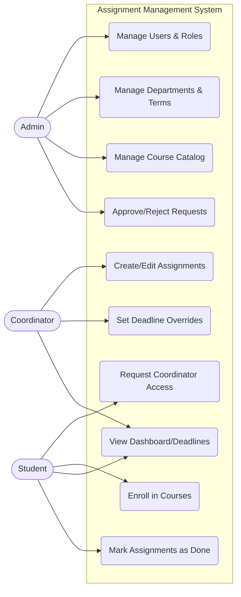
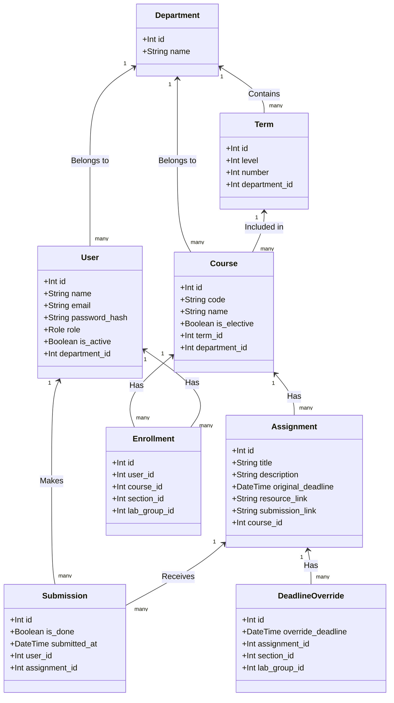
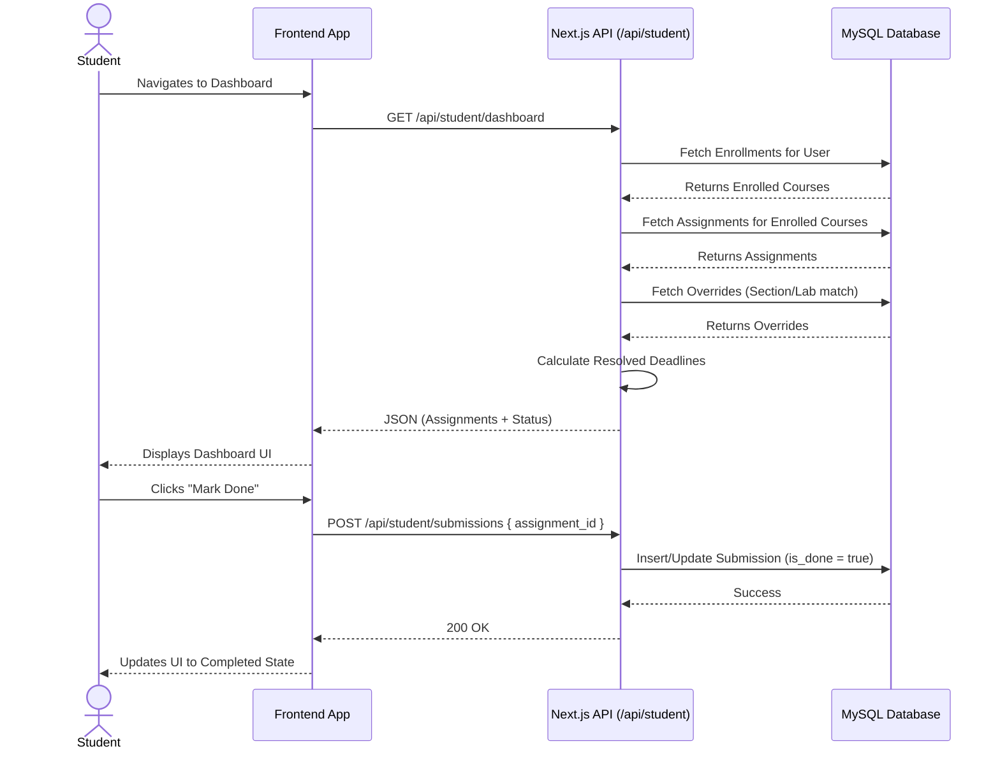
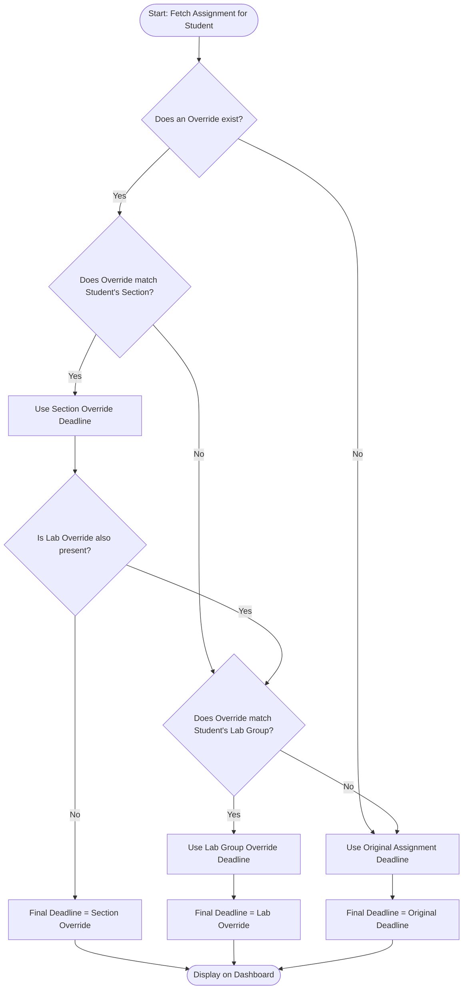
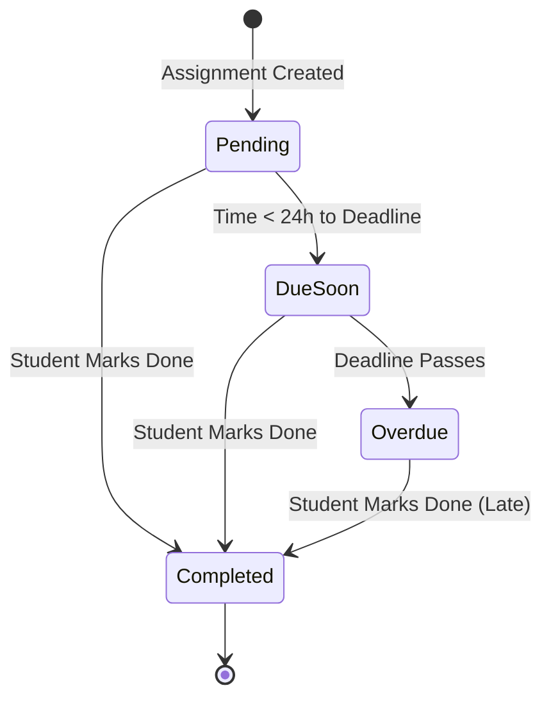

# System Architecture Diagrams

This document contains the core architectural diagrams for the Assignment Management System. Because these are written in Mermaid.js, you can view them directly in your IDE (if you have a markdown preview plugin) or by pasting this file into a GitHub repository.

## 1. Use Case Diagram
This outlines the primary actors in the system and their allowed interactions.

## 2. Class / Entity-Relationship Diagram
This illustrates the database schema and the relationships between the core data models.

## 3. Sequence Diagram
This demonstrates the chronological flow of a Student viewing their dashboard and marking an assignment as done.

## 4. Activity Diagram
This flowchart maps the logical decision process for calculating the **True (Resolved) Deadline** of an assignment for a specific student.

## 5. State Machine Diagram
This shows the lifecycle states of an `Assignment` relative to a student's `Submission`.

